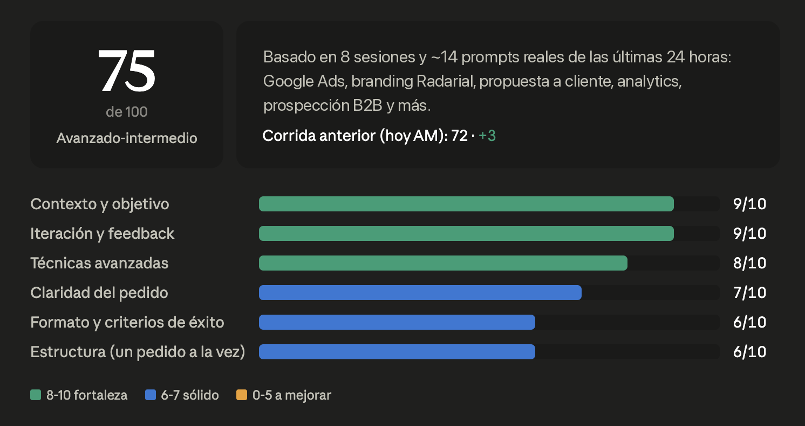

# prompt-audit

Una skill para Claude (Cowork / Claude Code) que audita cómo escribís tus prompts, analizando tus sesiones recientes reales.

> A Claude skill that audits how you write your prompts by analyzing your real recent sessions. Instructions are in Spanish, but the report is generated in whatever language you use.

## Qué hace

Lee una muestra de tus sesiones recientes, extrae los prompts que escribiste vos (no los generados por skills ni adjuntos) y devuelve:

- Un **puntaje global 0-100** con calibración honesta (no infla notas).
- Un **scorecard visual** con 6 dimensiones: contexto y objetivo, iteración y feedback, técnicas avanzadas, claridad, formato de salida, y estructura.
- **Recomendaciones concretas** basadas en citas textuales de tus propios prompts, incluyendo la versión reescrita de tus prompts más débiles.

Sirve tanto para una auditoría puntual como para un reporte recurrente (por ejemplo, diario con scheduled tasks) que compara contra el puntaje anterior.

## Ejemplo real

Así se ve el scorecard de una auditoría recurrente (con la comparación contra la corrida anterior):



## Instalación

**Cowork (app de escritorio):** empaquetá la carpeta como `.skill` y subila desde la sección de skills:

```bash
zip -r prompt-audit.skill prompt-audit/
```

**Claude Code:** copiá la carpeta a tus skills personales:

```bash
git clone https://github.com/fedecaccia/prompt-audit.git
cp -r prompt-audit/prompt-audit ~/.claude/skills/
```

## Uso

Simplemente pedile a Claude cosas como:

- "prompt audit"
- "¿cómo estoy prompteando?"
- "analizá mis prompts y dame un puntaje"
- "auditá la calidad de mis instrucciones de esta semana"

También podés programarlo como tarea recurrente ("hacé un prompt audit todos los días a las 9") para seguir tu evolución.

## Requisitos

La skill necesita acceso a las herramientas de lectura de sesiones del entorno (listar sesiones y leer transcripciones). Funciona mejor en Cowork o Claude Code desktop, donde ese acceso existe. Si además hay herramientas de visualización disponibles, el scorecard se renderiza como widget; si no, cae a una tabla markdown.

## Licencia

MIT
